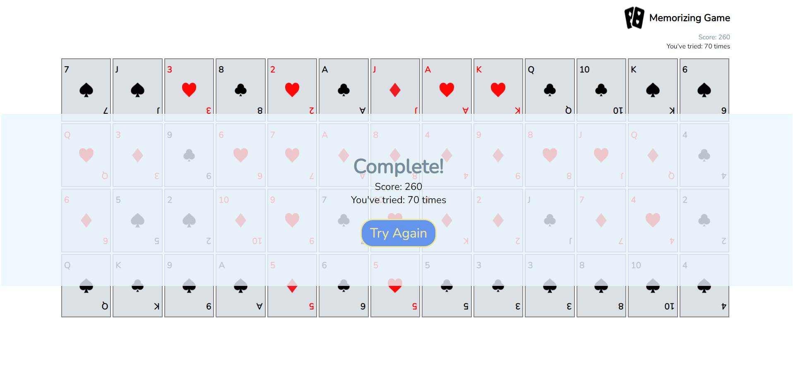

# Memorizing Card Game  
  

## How to play  
[[Play here]](https://ritachien.github.io/memorizing-card-game/)
- Flap two cards in 1 round. Pair cards with same numbers and get 10 points of score for each pair.  
- If pair matched, the cards keep number side on. If pair not matched, the cards flap back after 1 second.  
- Game finished when score reaches 260 points.  

## Project Info  
**Language used: Javascript**  
This is an exercise of modularization.  
- 2022.03.16 First commit.  